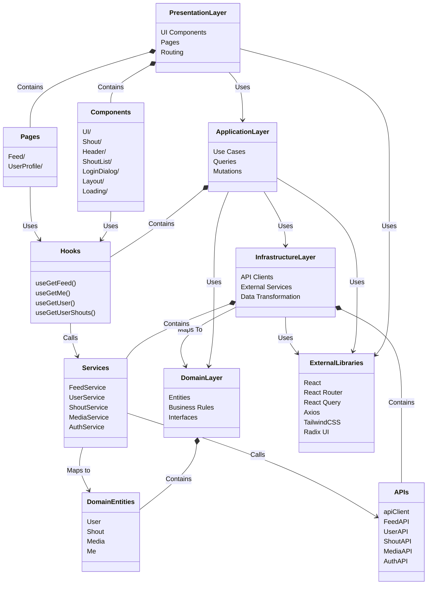
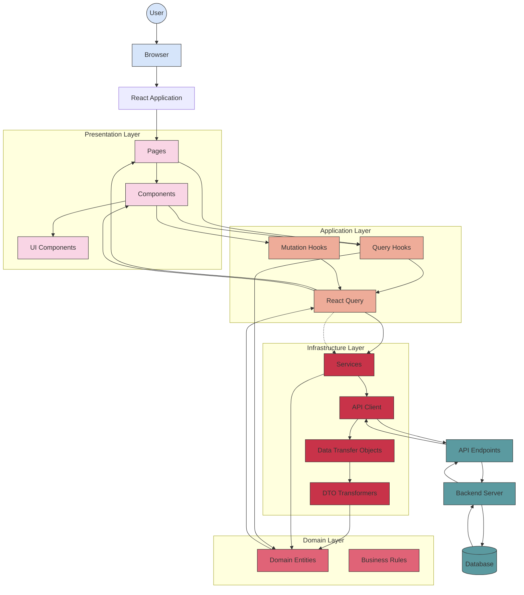

# React Clean Architecture Documentation

## 1. Introduction

This document describes a React application architecture based on Clean Architecture principles. This approach provides a clear separation of concerns, making the codebase more maintainable, testable, and adaptable to change. The architecture is particularly well-suited for medium to large-scale React applications that need to scale over time.

## 2. Architecture Overview

The application follows a layered architecture consisting of four main layers:

### 2.1. Layer Structure



1. **Presentation Layer**

   - Contains all UI components, pages, and routing logic
   - Responsible for rendering the UI and handling user interactions
   - Depends on the Application Layer but has no knowledge of the Infrastructure Layer

2. **Application Layer**

   - Contains use cases, query hooks, and mutation hooks
   - Orchestrates the flow of data between the Presentation and Infrastructure layers
   - Implements business logic that doesn't belong in the Domain Layer

3. **Domain Layer**

   - Contains business entities and core business rules
   - Has no dependencies on other layers
   - Represents the heart of the business logic

4. **Infrastructure Layer**
   - Contains implementations of interfaces defined in the Domain Layer
   - Handles communication with external services (APIs, storage, etc.)
   - Responsible for data transformation between external sources and domain entities

## 3. Data Flow in Detail



### 3.1. Reading Data Flow

1. **User Interaction**

   - User interacts with the application through the browser
   - A component or page requires data to render

2. **Request Initiation**

   - A component or page calls a query hook (e.g., `useGetFeed`, `useGetUser`)
   - The query hook uses React Query to manage the data fetching lifecycle

3. **Data Fetching**

   - React Query executes the query function
   - The query function calls the appropriate service (e.g., `FeedService.getFeed()`)
   - The service uses the API client to make an HTTP request to the backend

4. **Data Transformation**

   - The API client receives a response with DTOs (Data Transfer Objects)
   - Services transform DTOs into domain entities using transformer functions
   - Domain entities are returned to React Query's cache

5. **Rendering**
   - React Query provides the data to the query hook
   - The query hook returns the data to the component/page
   - The component/page uses the data to render the UI

### 3.2. Writing Data Flow

1. **User Interaction**

   - User performs an action that requires data mutation (e.g., creating a post)

2. **Mutation Initiation**

   - A component calls a mutation hook
   - The mutation hook uses React Query to manage the mutation lifecycle

3. **Data Submission**

   - React Query executes the mutation function
   - The mutation function calls the appropriate service
   - The service uses the API client to make an HTTP request to the backend

4. **Cache Invalidation**
   - Upon successful mutation, related queries are invalidated
   - React Query refetches the invalidated queries to update the UI with fresh data

## 4. Component Structure and Relationships

```mermaid
classDiagram
    %% Main Components
    class App {
        +QueryClient queryClient
        +Router router
    }

    class Layout {
        +Outlet
        +Header
    }

    class Pages {
        Feed
        UserProfile
    }

    %% Domain Components
    class Shout {
        +id: string
        +text: string
        +createdAt: Date
        +likes: number
        +reshouts: number
        +replies: Shout[]
        +authorId: string
    }

    class User {
        +id: string
        +handle: string
        +avatar: string
        +name: string
    }

    class Image {
        +id: string
        +url: string
        +shoutId: string
    }

    %% UI Components
    class ShoutComponent {
        +shout: Shout
        +author: User
        +image: Image
        +render()
    }

    class ShoutList {
        +shouts: Shout[]
        +users: User[]
        +images: Image[]
        +render()
    }

    class ReplyDialog {
        +shoutId: string
        +recipientHandle: string
        +handleSubmit()
    }

    class Header {
        +render()
    }

    class LoginDialog {
        +isOpen: boolean
        +handleLogin()
    }

    %% Page Components
    class FeedPage {
        +useGetFeed()
        +render()
    }

    class UserProfilePage {
        +handle: string
        +useGetUser()
        +useGetUserShouts()
        +render()
    }

    %% Application Hooks
    class useGetFeed {
        +queryKey: ["feed"]
        +data: {shouts, users, images}
        +isLoading: boolean
        +isError: boolean
    }

    class useGetUser {
        +queryKey: ["user", handle]
        +data: User
        +isLoading: boolean
        +isError: boolean
    }

    class useGetUserShouts {
        +queryKey: ["user", handle, "shouts"]
        +data: {shouts, images}
        +isLoading: boolean
        +isError: boolean
    }

    %% Services
    class FeedService {
        +getFeed()
    }

    class UserService {
        +getUser(handle)
        +getUserShouts(handle)
    }

    class AuthService {
        +login(username, password)
        +logout()
        +getMe()
    }

    %% Relationships
    App *-- Layout
    Layout *-- Pages
    Layout *-- Header

    Pages *-- FeedPage
    Pages *-- UserProfilePage

    FeedPage --> useGetFeed
    FeedPage *-- ShoutList

    UserProfilePage --> useGetUser
    UserProfilePage --> useGetUserShouts
    UserProfilePage *-- ShoutList

    ShoutList *-- ShoutComponent
    ShoutComponent *-- ReplyDialog

    useGetFeed --> FeedService
    useGetUser --> UserService
    useGetUserShouts --> UserService

    Header *-- LoginDialog
    LoginDialog --> AuthService

    ShoutComponent --> User
    ShoutComponent --> Shout
    ShoutComponent --> Image

    ReplyDialog --> Shout
```

### 4.1. Key Components

1. **App Component**

   - Entry point of the application
   - Sets up React Query and routing

2. **Layout Component**

   - Provides consistent layout across pages
   - Contains header and outlet for page content

3. **Page Components**

   - Feed Page: Displays feed of posts
   - User Profile Page: Displays user information and posts

4. **UI Components**
   - ShoutComponent: Displays individual post
   - ShoutList: Displays list of posts
   - ReplyDialog: Modal for replying to posts
   - Header: Navigation and authentication UI

### 4.2. Domain Entities

1. **Shout (Post)**

   - Represents a social media post
   - Contains id, text, creation date, likes, reshouts, replies

2. **User**

   - Represents a user profile
   - Contains id, handle, avatar, name

3. **Image**
   - Represents media attached to a post
   - Contains id, url, connection to a shout

## 5. Implementation Guidelines for New Projects

### 5.1. Project Structure

```
src/
├── components/           # UI Components grouped by feature
│   ├── ui/               # Reusable UI components
│   ├── feature-1/        # Components specific to feature 1
│   └── feature-2/        # Components specific to feature 2
├── pages/                # Page components
├── domain/               # Domain entities and interfaces
├── application/          # Use cases, query and mutation hooks
│   ├── queries/          # React Query hooks for fetching data
│   └── mutations/        # React Query hooks for mutating data
├── infrastructure/       # External service integrations
│   ├── api/              # API clients
│   ├── transformers/     # Functions to transform DTOs to domain entities
│   └── services/         # Service implementations
├── lib/                  # Utility functions and shared code
├── main.tsx              # Application entry point
└── app.tsx               # Main application component
```

### 5.2. Implementation Steps

1. **Define Domain Entities**

```tsx
// src/domain/user/index.ts
export interface User {
  id: string;
  handle: string;
  avatar: string;
  name: string;
}

export const fallbackUser: User = {
  id: "unknown",
  handle: "unknown",
  avatar: "/default-avatar.png",
  name: "Unknown User",
};
```

2. **Create API Client**

```tsx
// src/infrastructure/client.ts
import axios from "axios";

export const apiClient = axios.create({
  baseURL: "/api",
});
```

3. **Implement Data Transfer Objects (DTOs)**

```tsx
// src/infrastructure/user/dto.ts
export interface UserDto {
  id: string;
  type: "user";
  attributes: {
    handle: string;
    avatar: string;
    name: string;
  };
}
```

4. **Create Transformer Functions**

```tsx
// src/infrastructure/user/transform.ts
import { User } from "@/domain/user";
import { UserDto } from "./dto";

export function dtoToUser(dto: UserDto): User {
  return {
    id: dto.id,
    handle: dto.attributes.handle,
    avatar: dto.attributes.avatar,
    name: dto.attributes.name,
  };
}
```

5. **Implement Service Layer**

```tsx
// src/infrastructure/user/service.ts
import { User } from "@/domain/user";
import UserApi from "./api";
import { dtoToUser } from "./transform";

async function getUser(handle: string, api = UserApi): Promise<User> {
  const response = await api.getUser(handle);
  return dtoToUser(response.data);
}

export default { getUser };
```

6. **Create Query Hooks**

```tsx
// src/application/queries/use-get-user.ts
import { useQuery } from "@tanstack/react-query";
import UserService from "@/infrastructure/user/service";

export function getQueryKey(handle: string) {
  return ["user", handle];
}

export function useGetUser(handle: string) {
  return useQuery({
    queryKey: getQueryKey(handle),
    queryFn: () => UserService.getUser(handle),
  });
}
```

7. **Create UI Components**

```tsx
// src/components/user-profile/profile.tsx
import { User } from "@/domain/user";

interface ProfileProps {
  user: User;
}

export function Profile({ user }: ProfileProps) {
  return (
    <div className="profile">
      
      <h2 className="text-xl font-bold">{user.name}</h2>
      <p className="text-gray-500">@{user.handle}</p>
    </div>
  );
}
```

8. **Create Page Components**

```tsx
// src/pages/user-profile/user-profile.tsx
import { useParams } from "react-router-dom";
import { useGetUser } from "@/application/queries/use-get-user";
import { Profile } from "@/components/user-profile/profile";
import { LoadingView } from "@/components/loading";

export function UserProfile() {
  const { handle } = useParams<{ handle: string }>();
  const user = useGetUser(handle);

  if (user.isLoading) {
    return <LoadingView />;
  }

  if (user.isError) {
    return <div>Error loading user profile</div>;
  }

  return (
    <div className="user-profile-page">
      <Profile user={user.data} />
    </div>
  );
}
```

### 5.3. Best Practices

1. **Keep Components Focused**

   - Each component should have a single responsibility
   - Extract reusable logic into custom hooks
   - Extract reusable UI elements into separate components

2. **Domain Entity Integrity**

   - Domain entities should not contain infrastructure concerns
   - Always transform DTOs to domain entities at the boundary
   - Use interfaces to define the shape of domain entities

3. **State Management**

   - Use React Query for server state
   - Use React's built-in useState/useReducer for component state
   - Consider using Context API for shared state when needed

4. **Error Handling**

   - Handle errors at the appropriate level
   - Display user-friendly error messages
   - Log errors for debugging purposes

5. **Testing**
   - Test domain logic thoroughly
   - Mock external dependencies in tests
   - Use React Testing Library for UI tests

## 6. Conclusion

This Clean Architecture approach provides a solid foundation for building scalable React applications. By maintaining a clear separation of concerns and following the dependency rule (dependencies pointing inward), the codebase remains maintainable as it grows. The data flow patterns ensure consistent handling of server state and user interactions.

For new projects, start by defining the domain entities, then build outward to the infrastructure and application layers, and finally implement the presentation layer. This approach ensures that the core business logic remains independent of external concerns, making the application more flexible and easier to maintain over time.

export function MDXContent() {
  return (
    <div className="mdx-content">
      <h2>Interactive Architecture Explorer</h2>
      <p>
        This interactive component would allow you to explore the architecture
        in more detail. Implement this component based on your UI library of
        choice.
      </p>
    </div>
  );
}
